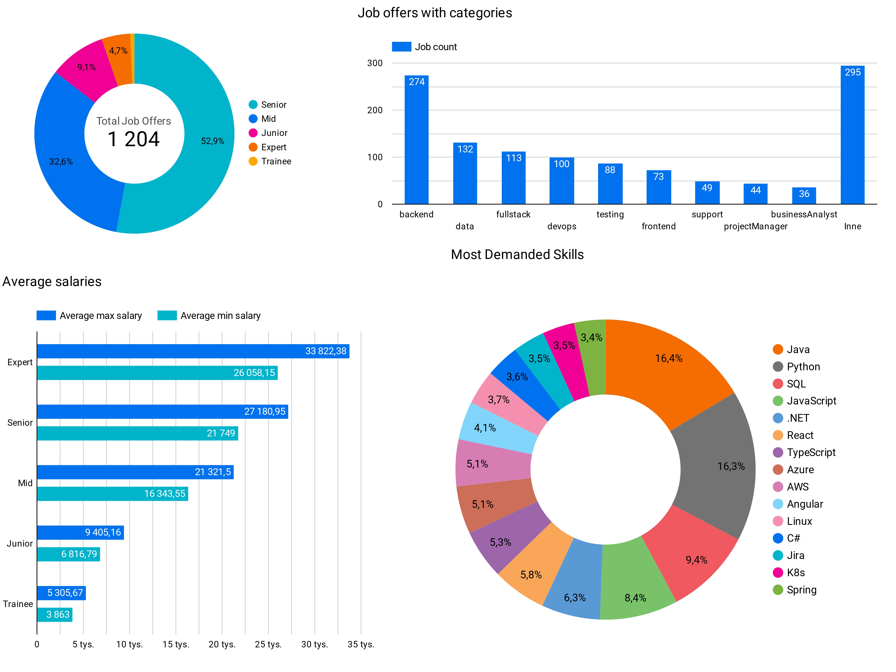

# ELT Pipeline for Job Postings

This project implements an end-to-end data pipeline to scrape job postings from a website, load the raw data into a Google Cloud Storage (GCS) bucket (data lake), clean and transform the data using Pandas, load the cleaned data into Google BigQuery (data warehouse) staging tables, manage and create fact and dimension tables using DBT. Eerything is orchestrated using Airflow. Create raports with Looker Studio.

# Project overview

The goal of this project is to automate the process of collecting job posting data from a website, transforming it for analysis, and storing it in a cloud-based data warehouse (BigQuery). The pipeline consists of the following steps:

**Data Scraping:** Scheduled scraping job postings from a website using Python.

**Raw Data Storage:** Store the raw scraped data in Google Cloud Storage (GCS).

**Data Cleaning & Transformation:** Clean and transform the raw data using Pandas.

**Data Loading:** Load the cleaned data into BigQuery.

**DBT:** Use DBT to create tables(star schema) in BigQuery for further analysis, testing.

**Orchestration:** Automate all steps using Apache Airflow for scheduling and monitoring.

**Visualization:** Use Looker Studio for creating raports.

## Workflow Design

## Staging Tables

## Fact and dimension tables

## Looker Studio raports example

## Technologies used

- Python
- SQL
- Airflow
- Pandas
- DBT
- Google Cloud BigQuery
- Google Cloud Storage
- Docker
- Looker Studio

