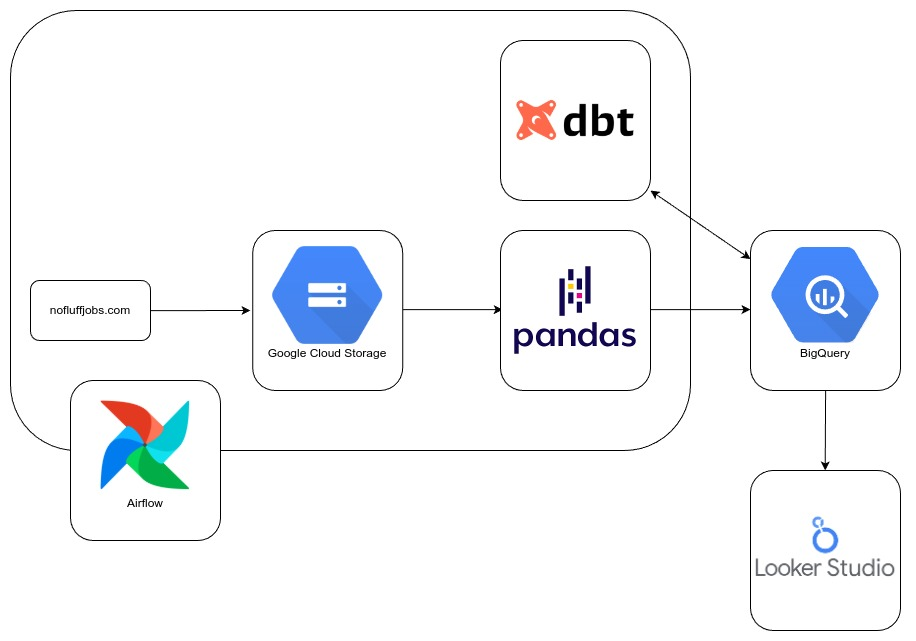
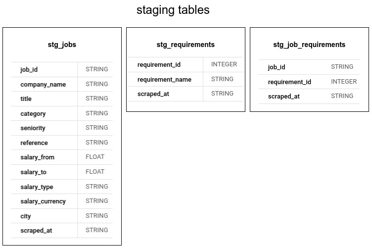
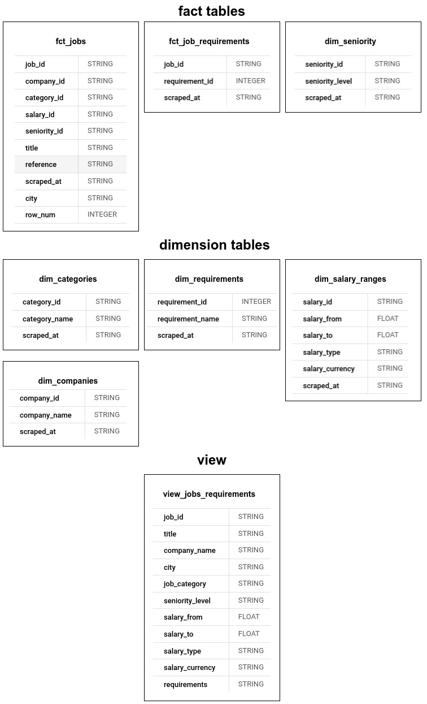

# ELT Pipeline for Job Postings

This project implements an end-to-end data pipeline to scrape job postings from a website, load the raw data into a Google Cloud Storage (GCS) bucket (data lake), clean and transform the data using Python and Pandas, and then load the cleaned data into Google BigQuery (data warehouse). DBT is used to create and manage tables in BigQuery for further analysis.

